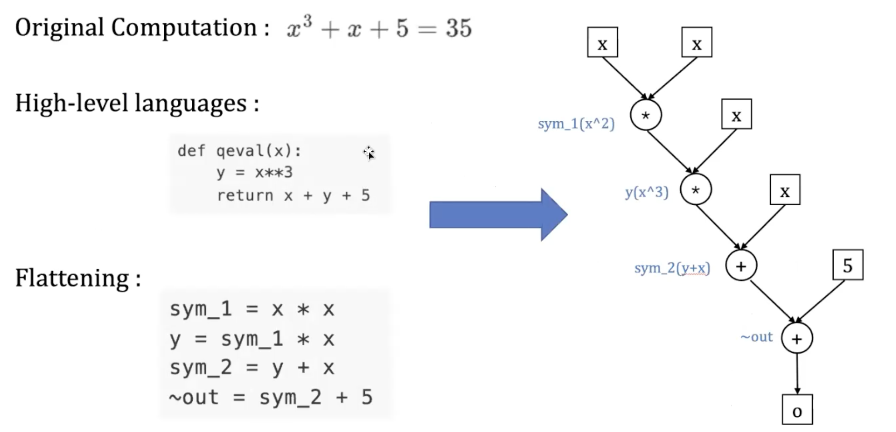
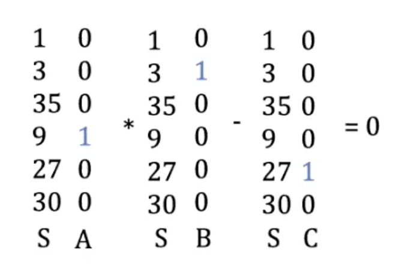
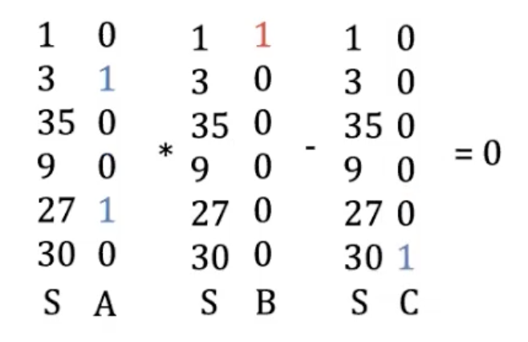
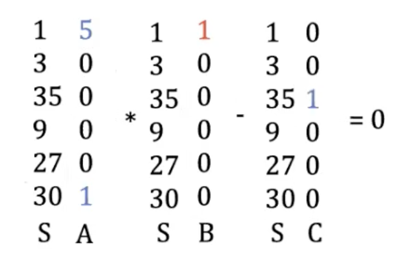

# ZK SNARKS Introduction

## Prerequisite(What is ZK SNARKS)
[Zero-knowledge proofs](http://people.csail.mit.edu/silvio/Selected%20Scientific%20Papers/Proof%20Systems/The_Knowledge_Complexity_Of_Interactive_Proof_Systems.pdf) were first introduced by Shafi Goldwasser, Silvio Micali and Charles Rackoff. A zero-knowledge proof allows one party, the prover, to convince another party, the verifier, that a given statement is true, without revealing any information beyond the validity of the statement itself. 

A `zkSNARK`(zero-knowledge succinct non-interactive argument of knowledge) is a variant of a zero-knowledge proof that enables a prover to succinctly convince any verifier of the validity of a given statement and achieves computational zero-knowledge without requiring interaction between the prover and any verifier.
> Zero knowledge proof can be divided into two categories:  
>* **Interactive zero knowledge proof**: The prover 𝒫 sends data to the verifier 𝒱, and the verifier 𝒱 also needs to send a challenge random number to the prover 𝒫. This interaction is similar to that of the TCP/IP protocol. Through multiple interactions, the verifier can verify the correctness of prover.
>* **Non interactive proof**: The prover 𝒫 generates a proof and sends it to the verifier 𝒱. The challenge random number is obtained by the prover based on the current data hash, and the difficulty of manipulating the challenge random number is the same as that of POW, making the scheme secure. The verifier 𝒱 only needs to verify consistency. There is no other additional data interaction in this process. Similar to the process where a user sends an ECDSA signature for consensus node consistency verification, the entire process only involves one data transmission.

zkSNARKs can be used to prove and verify, in zero-knowledge, the integrity of computations, expressed as NP statements. A prover with knowledge of the witness for the NP statement can produce a succinct proof that attests to the truth of the NP statement. Anyone can then verify this short proof, which offers the following properties:

* **Zero-knowledge** - the verifier learns nothing from the proof beside the truth of the statement (i.e., the value qux, in the examples above, remains secret).
* **Succinctness** - the proof is short and easy to verify.
* **Non-interactivity**: - it does not require back-and-forth interaction between the prover and the verifier.
* **Soundness** - the proof is computationally sound (i.e., it is infeasible to fake a proof of a false NP statement). Such a proof system is also called an argument.
* **Proof of knowledge** - the proof attests not just that the NP statement is true, but also that the prover knows why (e.g., knows a valid qux).

Together, these properties comprise a zkSNARK, which stands for a **Z**ero-**K**nowledge **S**uccinct **N**on-interactive **A**rgument of **K**nowledge.

After introducing the above theory, we will use a simple scenario to illustrate ZKSNARK: Alice wants to prove to Bob that a `house(public signal)` belongs to her. How can she prove it to Bob without showing him the `key(private input)` of house? Alice just needs to ask Bob to turn around while she opens the door to the house. Then, she asks Bob to turn back and show him that `the door is now open(statement)`. This proves that the house belongs to Alice. In this process, Alice has not revealed any part related to her key, so it is non-interactive.

In the above scenario, we can return to the NP problem mentioned earlier. For someone without the key (`without a private input`), the problem of opening a door is essentially `an intractable problem in polynomial time`. However, once a known solution is discovered (i.e., the door has been opened), a verifier can `confirm the correctness of this solution in polynomial time`. This is the essence of ZK-SNARKs. Later on, we will delve deeper into this core concept with some slightly more theoretical knowledge.


## How to construct ZK SNARKS?
OK，here we will explain how to construct ZK SNARKS. Below are several basic steps:

- Generate the CRS
- Construct arithmetic circuits
- Convert circuit to R1CS
- Convert R1CS to QAP
- Generate proof
- Verify proof


## Generate the CRS
In ZKSNARKs, `CRS(Common Reference String)` is a random public parameter generated by a trusted third party and used to verify the correctness of zero-knowledge proofs. ZKSNARKs rely on CRS as a public parameter for proving & verifying. This CRS must be generated in advance by a trusted party. The information used to create the CRS, called ‘toxic waste’ needs to be destroyed as soon as the CRS is created. Otherwise, it can be used by adversaries to forge fraudulent proofs.

It is worth noting that generating the CRS is computationally expensive, and its length is usually much longer than the length of the proof itself. Therefore, ZKSNARKs typically employ techniques to reduce the size and cost of generating the CRS, such as using the hash value of the common reference string as the root node and storing the intermediate values of the proof using a Merkle tree to efficiently verify the correctness of the proof.

In addition to the trusted part setup method mentioned above for generating CRS, [Powers of Tau](https://eprint.iacr.org/2017/1050) is also a ceremony used to generate CRS, which can help ensure that the generated CRS is safe and reliable. The [ceremony](https://github.com/ZcashFoundation/powersoftau-attestations/) was proposed by the core developers of Zcash in 2017 to address security risks that may exist in the CRS generation process, especially the risk of a man-in-the-middle attack.

The specific process of the "Powers of Tau" ceremony is that participants need to generate random numbers in a specific way according to a specific protocol and contribute them to the CRS generation process. After the participants submit their contributions, the contributions are combined together and verified using cryptographic methods to ensure that the generated CRS is correct and that no one can control the generation process through malicious means.

Due to the widely recognized security of the "Powers of Tau" ceremony, it has become a standard process for generating CRS in many zkSNARKs systems, such as the Bowe-Hopwood-Tessaro (BHT) construction for zk-SNARKs and the zk-SNARKs implementation for the Zcash cryptocurrency, among others.

## Construct arithmetic circuits
The arithmetic circuit in ZKSNARKs is a calculation model that transforms inputs into outputs through finite field operations or Boolean circuits, enabling various algorithms such as encryption, hashing, and signing. The arithmetic circuit is one of the key components in implementing zero-knowledge proofs.

ZKSNARKs permits proving computational statements, but they cannot be applied to the computational problem directly, the statement first needs to be converted into the right form. Specifically, zk-SNARKs requires the computational statement to be modeled with an arithmetic circuit. Although it may not always be obvious how to do this conversion, most computational problems we care about can easily be converted into arithmetic circuits.

So, the need for arithmetic circuits arises in ZKSNARK proofs because it is required to prove that a statement (such as the answer to a specific question) satisfies certain conditions without revealing any information about the statement. Therefore, a method is needed to verify whether a statement satisfies the conditions without revealing any information. The arithmetic circuit provides such a method by transforming the statement into a set of numbers, and then performing operations on these numbers to verify whether they satisfy the conditions without disclosing the original information.

In conclusion, the arithmetic circuit is an important component in ZKSNARK, providing a secure and private way to verify whether inputs satisfy specific conditions.

## Convert circuit to R1CS
The R1CS(Rank-1 Constraint System) is a mathematical expression used to represent arithmetic circuits. To represent each gate circuit, we use an equivalent vector dot product process called Rank-1 Constraint System (R1CS).R1CS can transform arithmetic circuits into a set of linear constraints, which can be used to generate zero-knowledge proofs.

The role of R1CS is to act as an intermediate representation, converting arithmetic circuits into a constraint system that can be used to generate proofs. It transforms each gate in the arithmetic circuit into a linear constraint, such as $Ax + By + Cz = 0$, where $A$, $B$, $C$ are constants and $x$, $y$, $z$ are input variables. By transforming each gate into a constraint, R1CS represents the arithmetic circuit as a system of linear equations, which can be solved using linear algebra. By solving this system of equations, the proof can be verified for correctness, achieving the goal of zero-knowledge proof.

The main reason for converting arithmetic circuits to R1CS is to simplify the proof generation process. In ZKSNARKs, generating a proof requires transforming the arithmetic circuit into a set of constraint systems and processing them with some specific numbers. Directly converting the arithmetic circuit into a constraint system may result in a cumbersome proof generation process that requires significant computing resources. Converting arithmetic circuits to R1CS can simplify the proof generation process and make proof generation more efficient.

Next, we will explain what R1CS (Rank-1 Constraint System) is using a simple [example](https://medium.com/@VitalikButerin/quadratic-arithmetic-programs-from-zero-to-hero-f6d558cea649) writen by Vitalik.

- Computational Problem(As show in the above fig with `Original Conputation`): proving that you know the solution to a cubic equation: x**3 + x + 5 == 35 (hint: the answer is 3)
- High-level language: If we were to express this computational problem in a high-level programming language, its form would be:
    ```
    def qeval(x):
        y = x**3
        return x + y + 5
    ```
- Flattening: Of course, as mentioned earlier, the problem formulation in the high-level programming language cannot be directly used for ZKSNARKs. We first need to transform this computational logic into the form of a circuit with gates. We need to us gate to construct a circuit that can represent the computational problem where `gate: x = y(op) z; op = +,-,*/`. All intermediate states in the computational problem need to be expressed in the form of gates, as shown in the above diagram.
    ```
    sym_1 = x * x
    y = sym_1 * x
    sym_2 = y + x
    ~out = sym_2 + 5
    ```

At this point, we have learned how to transform a simple computational problem into a representation form of a circuit with gates. The next step is to understand the key aspects of R1CS. we convert gates into something called a rank-1 constraint system (R1CS).

An R1CS is a sequence of groups of three vectors $(a, b, c)$, and the solution to an R1CS is a vector $s$, where $s$ must satisfy the equation $s . a * s . b - s . c = 0$, where . represents the dot product - in simpler terms, if we "zip together" $a$ and $s$, multiplying the two values in the same positions, and then take the sum of these products, then do the same to $b$ and $s$ and then $c$ and $s$, then the third result equals the product of the first two results. 

For example, this is a satisfied R1CS for the gate `sym_1 = x * x`:  


We can observe that $S$ is actually the unique symbol value among all the gates in the circuit(Also, we call these unique symbols as witness which is simply the assignment to all the variables, including input, output and internal variables) where symbol ~one can be used to represent a constant value:

    ~one: 1
    x:    3
    ~out: 35
    sym_1:9
    y:    27
    sym_2:30

$A$, $B$, $C$ take values (0/1) according to the equations mentioned above and we will get the (A, B, B) triple for the first gate:
```
A = [0, 1, 0, 0, 0, 0]
B = [0, 1, 0, 0, 0, 0]
C = [0, 0, 0, 1, 0, 0]
```

Also, for the second gate: `y = sym_1 * x`:     


We can get the triple:

```
A = [0, 0, 0, 1, 0, 0]
B = [0, 1, 0, 0, 0, 0]
C = [0, 0, 0, 0, 1, 0]
```

For the third gate: `sym_2 = y + x`:      


We can get the triple:
```
A = [0, 1, 0, 0, 1, 0]
B = [1, 0, 0, 0, 0, 0]
C = [0, 0, 0, 0, 0, 1]
```

For the fourth gate: `~out = sym_2 + 5`:     


We can get the triple:
```
A = [5, 0, 0, 0, 0, 1]
B = [1, 0, 0, 0, 0, 0]
C = [0, 0, 1, 0, 0, 0]
```

Finally, we have our complete satisfied R1CS with four constraints:


$$
A=    \begin{bmatrix}
    0 & 1 & 0 & 0 & 0 & 0 \\
    0 & 0 & 0 & 1 & 0 & 0 \\
    0 & 1 & 0 & 0 & 1 & 0 \\
    5 & 0 & 0 & 0 & 0 & 1 \\
    \end{bmatrix}
$$


$$
B=    \begin{bmatrix}
    0 & 1 & 0 & 0 & 0 & 0 \\
    0 & 1 & 0 & 0 & 0 & 0 \\
    1 & 0 & 0 & 0 & 0 & 0 \\
    1 & 0 & 0 & 0 & 0 & 0 \\
    \end{bmatrix}
    $$


$$
C=    \begin{bmatrix}
    0 & 0 & 0 & 1 & 0 & 0 \\
    0 & 0 & 0 & 0 & 1 & 0 \\
    0 & 0 & 0 & 0 & 0 & 1 \\
    0 & 0 & 1 & 0 & 0 & 0 \\
    \end{bmatrix}
    $$


## Convert R1CS to QAP
In ZKSNARKs, R1CS is a constraint system used to represent arithmetic circuits. However, directly using R1CS for proofs is not practical as it requires a lot of computing resources and memory. R1CS is a way of describing arithmetic circuits where each gate of the circuit is described as a linear constraint. Although this format is intuitive, it can lead to overly complex and inefficient processing and verification.Therefore, to simplify the proof process, we need to further transform R1CS into a more compact form. This is where QAP (Quadratic Arithmetic Program) comes in.

QAP implements the exact same logic except using polynomials instead of dot products. Next, we will explain how to transform from R1CS to QAP step by step:

* **Mapping from R1CS to QAP**: The first step is to map each constraint of R1CS to the format of QAP. For each constraint of R1CS, such as $A * B - C = 0$, we need to construct three polynomials $A(x)$, $B(x)$, $C(x)$ such that for all i, $A(i) * B(i) - C(i) = 0$.

* **Constructing the target polynomial**: After constructing the polynomials $A(x)$, $B(x)$, $C(x)$, we create a target polynomial $Z(x)$ whose roots include the solution to the R1CS constraint.

* **Verification**: Finally, we verify that these polynomials satisfy the relation $A(x) * B(x) - C(x) = H(x) * Z(x)$, where $H(x)$ is an auxiliary polynomial. If this relation holds, then we have proved the original R1CS constraint.

By following these steps, we can convert R1CS to QAP. QAP is a more compact representation form that can greatly simplify the proof process and improve the efficiency and scalability of proofs.

For the above example in R1CS, We go from four groups of three vectors of length six to six groups of three degree-3 polynomials, where evaluating the polynomials at each x coordinate represents one of the constraints. That is, if we evaluate the polynomials at x=1, then we get our first set of vectors, if we evaluate the polynomials at x=2, then we get our second set of vectors, and so on. We can make this transformation using something called a `Lagrange interpolation`. For each x coordinate, we can create a polynomial that has the desired y coordinate at that x coordinate and a y coordinate of 0 at all the other x coordinates we are interested in, and then to get the final result we add all of the polynomials together. 

Taking the vector group $A$ as an example, we first need to calculate the polynomials corresponding to the first value of each $a$ vector for the four constraints. That is, we apply the Lagrange interpolation method to the first column of the vector group A, and find the polynomial that passes through the four points (1,0), (2,0), (3,0), and (4,5). We can use the online tool [Cubic Polynomial Generator](http://skisickness.com/2010/04/28/) to solve this, or write a script ourselves. The resulting polynomial is as follows:  

$$y_1 = -5 + 9.166x - 5x^2 + 0.833x^3$$

Arrange the coefficients of a polynomial in ascending order of the degree of $x$ to obtain the coefficient vector $(-5.0, 9.166, -5.0, 0.833)$.
It is not difficult to verify that by substituting $x = 1, 2, 3, 4$ into the above polynomial, we can recover the first column vector $(0,0,0,5)$ of matrix $A$.


Finally, we will get the QAP:

$$
A_{poly}=    \begin{bmatrix}
    -5.0 & 9.166 & -5.0 & 0.833 \\
    8.0 & -11.333 & 5.0 & -0.666 \\
    0.0 & 0.0 & 0.0 & 0.0 \\
    -6.0 & 9.5 & -4.0 & 0.5 \\
    4.0 & -7.0 & 3.5 & -0.5 \\
    -1.0 & 1.833 & -1.0 & 0.166 \\
    \end{bmatrix}
    $$


$$
A_{poly}=    \begin{bmatrix}
    3.0 & -5.166 & 2.5 & -0.333 \\
    -2.0 & 5.166 & -2.5 & 0.333 \\
    0.0 & 0.0 & 0.0 & 0.0 \\
    0.0 & 0.0 & 0.0 & 0.0 \\
    0.0 & 0.0 & 0.0 & 0.0 \\
    0.0 & 0.0 & 0.0 & 0.0 \\
    \end{bmatrix}
    $$


$$
C_{poly}=    \begin{bmatrix}
    0.0 & 0.0 & 0.0 & 0.0 \\
    0.0 & 0.0 & 0.0 & 0.0 \\
    -1.0 & 1.833 & -1.0 & 0.166 \\
    4.0 & -4.333 & 1.5 & -0.166 \\
    -6.0 & 9.5 & -4.0 & 0.5 \\
    4.0 & -7.0 & 3.5 & -0.5 \\
    \end{bmatrix}
    $$

After the transformation from R1CS (Rank-1 Constraint System) to QAP (Quadratic Arithmetic Program), it is possible to simultaneously check all constraints using polynomial inner product operations, instead of individually checking each constraint as done in R1CS, like below figure:


To check correctness, we don’t actually evaluate the polynomial $t = A·s * B·s - C·s$ at every point corresponding to a gate; instead, we divide $t$ by another polynomial, $Z$, and check that $Z$ evenly divides $t$, that is, the division $t / Z$ leaves no remainder where $Z(x)=(x−1)(x−2)(x−3)(x−4)$

Simply put, checking if the polynomial $A(x) * B(x) - C(x)$ is equal to zero at $x = 1, 2, 3, 4$ is equivalent to checking if this polynomial can be divided evenly by $Z(x) = (x - 1)(x - 2)(x - 3)(x - 4)$, based on basic algebraic principles.

The previously mentioned solution vector(which is also called witness) $s = [1, 3, 35, 9, 27, 30]$. Here, we will take the inner product of the solution vector with three coefficient polynomials, which can be expressed as follows:

$$A(x) * B(x) - C(x) = (A_{poly} · s) * (B_{poly} · s) - (C_{poly} · s) = t$$

Also, $Z(x)$ can denoted as:
$$Z(x)=(x−1)(x−2)(x−3)(x−4)$$

We only need to check $t / Z$ leaves no remainder:
$$H=t/Z$$

where $H$ must is a result of division without any remainder.


>Finally, based on the QAP transformation process described above, we can gain a deeper understanding of why QAP is needed: 
If the vector $s$ is not known, one can only randomly choose a vector $s$, compute the QAP polynomial, and then check if $Z(x)$ satisfies the divisibility relationship. If it satisfies, the solution is accepted; otherwise, it is rejected. Therefore, it would take exponential time for adversary to brute force search for the vector $s$. However, once the witness vector $s$ is given, it is possible to quickly construct the QAP polynomial based on $s$ and efficiently verify if $Z(x)$ satisfies the divisibility relationship with the constructed QAP polynomial. Thus, the divisibility relationship between the polynomial $Z(x)$ and the QAP/QSP polynomial, satisfying singularity, constitutes an NP problem. In this way, we can better conceal the $s$. That is the magic of Zero knowledge proof.

## Generate proof
In ZK-SNARKS, the process of generating a proof is typically performed using the proof algorithm of a zero-knowledge proof system, which allows a prover to prove the truth of a statement or assertion to a verifier without revealing any other information about the statement or assertion.

The process of generating a proof includes the following steps:

- **Computing witness**: For a statement that needs to be proven, the prover first needs to compute a solution that satisfies the statement. This solution is also known as a `witness`.

- **Generating QAP**: The prover transforms the statement into an R1CS (Rank 1 Constraint System), and then converts the R1CS into a `QAP` (Quadratic Arithmetic Program).

- **Generating proof**: Using the witness and QAP, the prover generates a proof by performing a series of computations. This `proof` contains elements such as the evaluation of polynomials and values at specific points.

In this process, the key to generating a proof is how the prover constructs the proof. The prover needs to select appropriate random values and use them to calculate some values that satisfy the constraints and generate the proof.

The process of generating a proof is a crucial step in ZKSNARKS, as it determines the security and efficiency of the proof system.

## Verify proof
In ZK SNARKs, the process of verifying a proof typically uses the verification algorithm of a zero-knowledge proof system, which allows a verifier to verify the statement without revealing any other information about the statement or assertion.

The process of verifying a proof includes the following steps:
- Input checking: The verifier checks whether the input conforms to the required format.
- Public reference string checking: The verifier checks whether the common reference string is consistent with the one used to generate the proof.
- Proof verification: The verifier uses the common reference string, the statement, and the proof to verify its correctness. This process typically involves operations on vectors and matrices.
- Output decision: Based on the verification result of the proof, the verifier decides whether to accept the truthfulness of the statement. If the proof passes the verification, the verifier accepts the truthfulness of the statement. Otherwise, the verifier rejects the truthfulness of the statement.

## Reference
[1] [Participate in our trusted setup ceremony](https://filecoin.io/blog/posts/participate-in-our-trusted-setup-ceremony/)  
[2] [setup ceremony](https://zkproof.org/2021/06/30/setup-ceremonies/)  
[3] [quadratic-arithmetic-programs-from-zero-to-hero](https://medium.com/@VitalikButerin/quadratic-arithmetic-programs-from-zero-to-hero-f6d558cea649)  
[4] [exploring-elliptic-curve-pairings](https://medium.com/@VitalikButerin/exploring-elliptic-curve-pairings-c73c1864e627)  
[5] [zk-snarks-under-the-hood](https://medium.com/@VitalikButerin/zk-snarks-under-the-hood-b33151a013f6)  
[6] [learn.0xparc.org](https://learn.0xparc.org/)   
[7] [ZK-learning](https://zk-learning.org/)